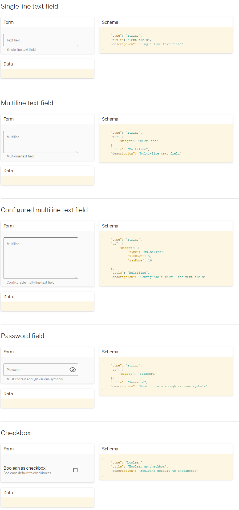

# form
Form to preapre example FaaS service

## required

+ git, https://gitforwindows.org/
+ nodejs

## Installation on windows

download using git command

    git clone https://github.com/promagen/windows.git promagen-win
    cd promagen-win

## start working with FaaS Form

    download.bat
    install.bat
    
    restart.bat

### start browser on  http://localhost:3001/

+ [FaaS Form](http://localhost:3001/)

## check in console

    doc.bat

    info.bat

## update

    update.bat

## Form HTML package

[Json Form Demo](https://json-tools.github.io/json-form/)

https://github.com/json-tools/json-form-custom-element
